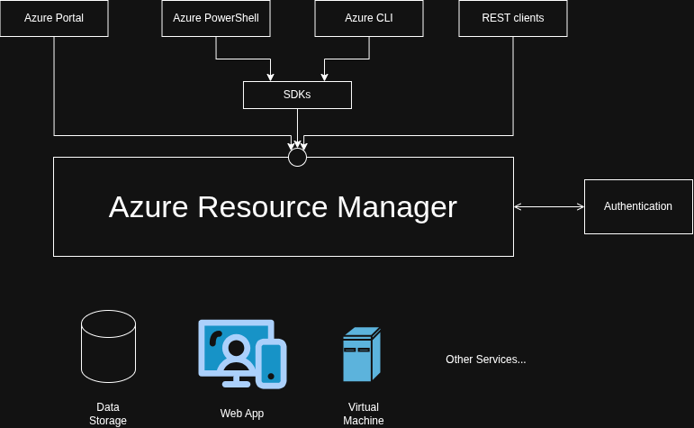

## Resource

As a user, when you purchase a service on Azure, whether it is a web hosting,
a virtual machine, or a database, your are purchasing what is referred to as
"Resource".

Its a generic object in a JSON template that represents a service you have 
purchased and remains available for the lifecycle of the service. 

Example:

```json
{
    "type": "Microsoft.Web/sites",
    "apiVersion": "2024-01-01",
    "name": "[variables('webAppPortalName')]",
    "location": "[parameters('location')]"
}
```

A resource contains all the configuration properties needed to deploy your
service.

All resources contain for common properties:
- Type
- API
- Version
- Name
- Location

Depending on the service, additional configuration options will be available.

## Resource Group

However, a resource cannot be created without a "Resource Group".

Recourse Groups are logical groupings that hold related resources for an 
application.

Resource Groups are used to group related resources sharing the same lyfecicle, 
permissions, and policies.

Consider, for example, a web app with an attached SQL database

Web App <---> Database

To jointly manage, monitor, and maintain them, simply group them in the same
Azure Resource Group.

You can use Resource Groups to control access and organize your resources after
you have deployed to Azure.

You can group your resources in different ways, including by:
- Service Type.
- Application Lifecicle.
- Department.
- Location
- etc

No one policy fits all, many organizations adopt a combination of these to
suit their specific needs. 

## ARM (Azure Resource Manager)

You can use many methods to purchase Azure services, most commonly through the
portal. 

No matter which method you choose to purchase Azure, it all goes through
the "Azure Resource Manager".

Its a centralized management layer for all Resources and Resource Groups in 
Azure, using an unified language. 



[Edit Diagram](diagrams/AzureResourceManager.drawio)

The Resource Manager checks privileges against "Azure Active Directory" anytime
an user wants to create, manage, or delete a resource.

Azure Active Directory is Microsoft's cloud-based identity and access management
service that enables employees to securely sign in and access applications.

It easily integrates with the on-premise Active Directory to extend its 
capabilities.

## Core Offerings

Core services include:
- Compute.
- Storage.
- Databases.
- Networking.

## Compute

Refers to a category of services that enable you to provision and manage 
cloud resources, like the infrastructure needed to run your applications 
without the need to manage the physical hardware.

Azure Compute has a variety of offerings, including:
- Virtual Machines.
- Container Instances.
- Kubernetes Services.
- etc

## Storage

Its the managed service in Azure responsible for providing a range of readily 
available cloud storage solutions on the use case, from virtual machines images
down to multimedia files.

Azure Storage has a variety of offerings, including:
- Azure Data Lake Storage.
- Azure Files.
- Azure Blob Storage.
- etc

## Databases

These are powerful tools for storing structured and semi-structured data by
providing a central repository to quickly retrieve and manage your data.

Azure Database has a variety of offerings, including:
- Cosmos Database.
- SQL Database.
- SQL Managed Instances.
- etc

## Networking

It's all about connecting different resources, whether that be within the 
Azure Platform or on-premise networks.

Azure network is your digital highway, connecting different parts of your cloud
envirnoment just as roads connect places.

Azure Networking has a variety of offerings, including:
- Content Delivery Network.
- Virtual Network Manager.
- VPN Gateway.
- etc.

-----

### Exercise:

Which of the following is Microsoft's cloud-based identity and access management service?

[ ] Azure Compute
[X] Microsoft Entra ID (formerly Azure Active Directory)
[ ] Azure Networking
[ ] Azure Storage